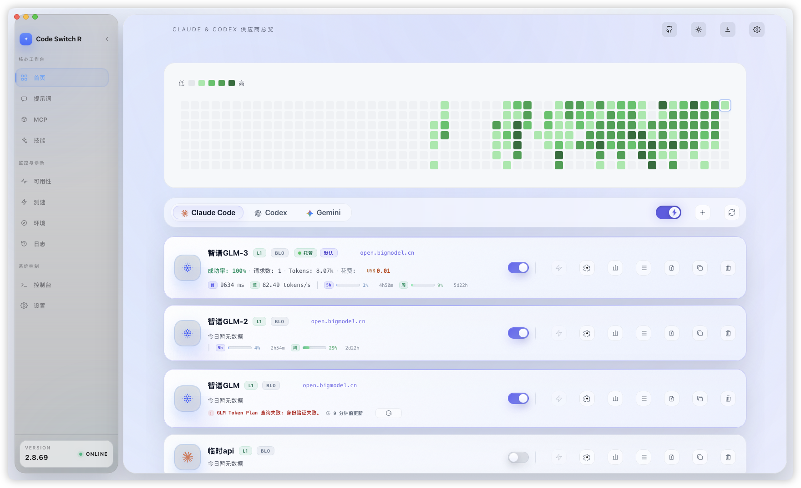
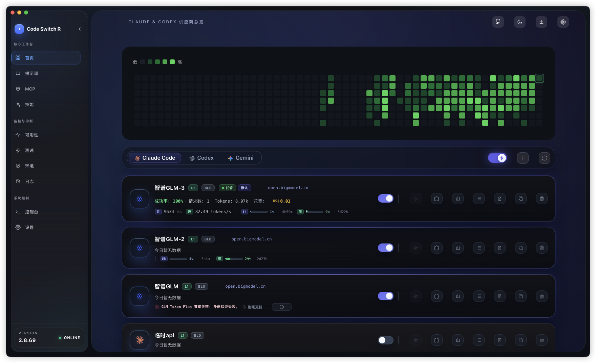
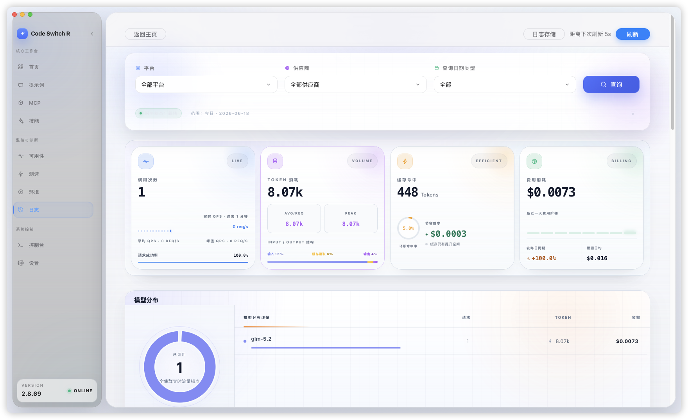
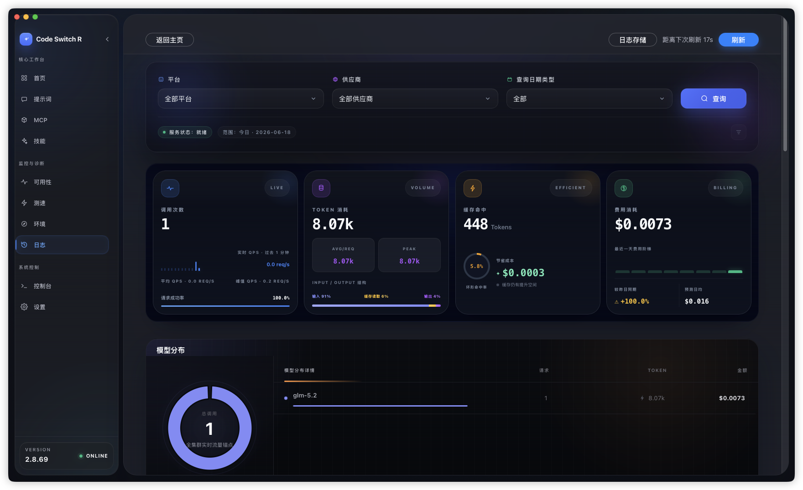

# Code Switch

> Manage all your AI coding assistants in one place

[简体中文](README.md) | **English**

## Screenshots

| Light Theme | Dark Theme |
|---------|---------|
|  |  |
|  |  |

## What is this?

**Code Switch** is a desktop app that helps you solve these problems:

- Have multiple AI API keys and want to switch between them flexibly?
- Want automatic failover to a backup provider when an API goes down?
- Want providers auto-disabled before their quota runs out?
- Want to track how many tokens you use and how much you spend every day?
- Want to run models across different API protocols without converting formats by hand?
- Want to manage MCP servers, system prompts, and Skills in one place?

**In short**: install it, flip the switch, and your AI coding CLI requests will automatically go through the providers you configured — with automatic failover, protocol conversion, quota protection, usage statistics, and cost tracking.

## Supported CLIs

| CLI | How it connects |
|-----|---------|
| Claude Code | Local proxy takeover (`/v1/messages`), environment config rewritten automatically |
| Codex | Local proxy takeover (`/responses`) |
| Gemini CLI | Local proxy takeover (`/gemini/*`) |
| OpenCode | Providers synced directly into the OpenCode config file (openai-compatible format) |
| Custom CLI | Local proxy takeover (`/custom/:toolId/*`) — bring any tool compatible with the Anthropic Messages API |

## Quick Start

### 1. Download & Install

Go to [Releases](https://github.com/GoldenTangerine/code-switch-R/releases) and download the package for your system (`vX.X.X` in filenames is the version number):

| OS | Recommended download |
|------|---------|
| Windows | `CodeSwitch-vX.X.X-amd64-installer.exe` |
| macOS (Apple Silicon) | `CodeSwitch-vX.X.X-macos-arm64.zip` |
| macOS (Intel) | `CodeSwitch-vX.X.X-macos-amd64.zip` |
| Linux | `CodeSwitch-vX.X.X.AppImage` |

### 2. Add a Provider

After launching the app:

1. On the home page, pick the platform tab you want to configure (Claude / Codex / Gemini / OpenCode)
2. Click the **New** button
3. Fill in the provider info:
   - **Name**: anything you like, e.g. "Official API"
   - **API URL**: the provider's endpoint
   - **API Key**: your key
4. Save

### 3. Turn on the Proxy Switch

Above the provider list of each platform tab, turn on the **proxy switch** (blue means on). Each platform has its own independent switch.

Done! Requests from that platform's CLI now go through the Code Switch proxy automatically.

## Features

### Provider Management

Each platform manages its own provider list:

| Feature | Description |
|------|------|
| Multiple providers | Add as many API providers per platform as you like |
| Drag to reorder | Drag cards to adjust priority |
| Per-provider toggle | Enable/disable individually; disabled cards move to the top of the inactive group so you can find them quickly |
| One-click apply | Write a provider directly into the CLI's native config file |
| Duplicate | Copy an existing configuration in one click |
| Data overview | Per-provider totals of requests, success rate, tokens, and cost |
| Cost trend | Per-provider cost curve over time |
| Model list | View a provider's available models (with 24-hour cache) |

The provider editor also supports: per-provider auth field (`ANTHROPIC_AUTH_TOKEN` / `ANTHROPIC_API_KEY` / custom header), concurrency limits, budget quotas, model whitelists, and more.

### Smart Proxy & Automatic Failover

With multiple providers configured:

```
Request starts
    ↓
Try provider A (Level 1) → fails
    ↓
Try provider B (Level 1) → fails
    ↓
Try provider C (Level 2) → success!
    ↓
Return result
```

**Priority groups (Levels)**:
- Level 1: highest priority (preferred)
- Level 2-9: backups
- Level 10: lowest priority (last resort)
- Providers at the same level are tried in order; round-robin mode is supported

**Automatic protocol conversion**: built-in two-way conversion between Anthropic Messages and OpenAI Chat / Responses formats. Providers speaking either protocol can be mixed, and model mapping rewrites mismatched model names on the fly.

**Stream-abort protection**: a streaming request is only attempted once per provider — if the stream breaks, the next provider takes over immediately. Requests you cancel yourself (recorded as client_abort) never count against the provider and never trigger blacklisting.

### Claude Model Routing & Mapping

A complete routing system for Claude Code:

- **Model-based routing**: pick providers based on the requested model name (off by default; enable in Settings)
- **Per-mapping switches**: every mapping rule can be toggled individually; the card shows "enabled/total"
- **Forced reasoning effort**: each mapping can pin low / medium / high / xhigh / max, written into the right field for the upstream protocol
- **1M context declaration**: native Anthropic-format mappings can declare 1M context support; the matching beta flag is injected automatically on a hit
- **Subagent model**: independently choose the model used by Claude Code subagents
- **Default fallback model**: the safety net when no mapping matches
- **Model aggregation**: `/v1/models` returns the deduplicated, sorted model list across providers
- **Connection details**: the home page shows the live "requested model → actual model" routing chain; hover to see which mapping rule was hit

### Reliability & Blacklisting

- **Dual counters, dual thresholds**: real request failures and background health-check failures are counted independently with separate thresholds (real failures default to 5; health-check threshold configurable from 2-9)
- **Blacklist duration**: fixed 30 minutes by default; optionally enable leveled blacklisting with escalating durations (L1 5 minutes → L5 24 hours)
- **Three-way success accounting**: client aborts, local concurrency limits, and internal proxy errors are excluded from the success-rate denominator, keeping the numbers honest
- **Visible and controllable**: cards show the remaining blacklist countdown, the trigger source and reason, with one-click unblacklist and level reset
- **Automatic recovery**: expired blacklist entries are checked and lifted every minute

### Quota Protection & Budgets

A complete pipeline to keep provider quotas from running over:

- **Remote quota queries**: built-in presets for GLM / Kimi / MiniMax, plus custom JS scripts to query any provider
- **Auto-disable on exhaustion**: when enabled (off by default), providers with quota queries configured are disabled automatically when their quota runs out, and re-enabled when it recovers
- **Background recovery checks**: quotas are re-checked as long as the app is alive (default every 60 seconds, configurable 10-3600), even while the app sits in the system tray
- **Recovery notifications**: optional system notifications (off by default); multiple recoveries in the same round are merged into one
- **Manual control wins**: providers you disabled yourself are never auto-enabled; auto-disabled providers can be "temporarily enabled" or returned to automatic management
- **Five budget tiers**: 5-hour / daily / weekly / monthly / total, with calibration adjustments
- **Tray dashboard**: click the system tray icon to see quota remaining, spend, exhaustion forecasts, and reset countdowns

### Usage Statistics & Cost Accounting

- **Dual data sources**: proxy logs + local CLI session scanning (one scan at startup, then incremental sync every minute; WSL scanning supported on Windows). Even requests that bypass the proxy are counted as long as the CLI keeps local session records; in "All" mode the two sources are deduplicated one-to-one
- **Three data views**: request details / provider statistics / model statistics, sortable by key metrics
- **Billing model chain**: global billing-model filter showing the full "billing model → routed model" chain
- **Usage heatmap**: a "green brick wall" on the home page visualizes daily consumption, with adjustable granularity
- **Cost accounting**: built-in model pricing (with cloud sync for the latest prices and custom overrides), calculated against official pricing
- **Auto refresh**: off / 5 / 10 / 30 / 60 second intervals

### Availability Monitoring

- **Two modes**: active probing / statistics from request logs (log mode by default — no extra requests sent)
- **History bars**: 72 status segments per provider; hover for latency, failure rate, error rate, and slow requests
- **Status levels**: healthy / degraded / down / unmonitored
- **Time ranges**: 15 minutes / 1 hour / 6 hours / 24 hours / 7 days
- **Per-provider config**: set test model, endpoint, and timeout individually, or pause monitoring

### Auth Center

- **Official Codex OAuth login**: device-code flow to sign in to your official subscription account
- **Multi-account management**: add multiple accounts, set a default, remove one or sign out all
- **No interference**: official subscriptions and third-party API providers stay independently controllable

### MCP Server Management

- Manage MCP Servers for Claude Code / Codex / Gemini in one place
- Enable/disable per platform, synced automatically to each CLI's config
- Visual environment variable editing
- Batch import supported

### Skill Marketplace

- One-click install of Claude Skills from Skill repositories
- Project-level / user-level grouping and management
- Add custom Skill repository sources
- Open local Skill folders or jump to the GitHub source directly

### Prompt Management

- Configure custom system prompts for Claude Code / Codex / Gemini separately
- Markdown editor; enabling a prompt writes it into the CLI's prompt file
- Import from existing files; inspect the currently active file content anytime

### API Speed Test

- Batch concurrent latency tests (10-second timeout)
- One-click sync of endpoints from your configured Claude / Codex / Gemini providers
- Color-coded latency: <300ms green / <500ms yellow / <800ms orange / red beyond that

### Environment Variable Check

- Scans system environment variables and CLI config files
- Finds variable conflicts that may break your AI coding tools (e.g. leftover proxy addresses or auth keys)
- Labels the source of each variable: system environment or a specific config file path

### Console

- Live view of the app's runtime logs for diagnosing proxy behavior
- Level filtering (error/warning/info/debug) + keyword search
- Smart parsing of provider errors, extracting diagnostic tags and matching error links

### WebDAV Cloud Sync

- Back up your configuration to WebDAV storage (Jianguoyun, Nextcloud, etc.)
- Connection testing, upload, download, and sync content preview
- One-click config migration when switching machines

### More Features

- **Auto-update**: built-in update check, download, and restart
- **Launch at login**: start automatically with your system
- **Light & dark themes**: follow the system or switch manually
- **Chinese & English UI**: switch interface language anytime
- **WSL support**: on Windows, scan CLI configs and session records inside WSL
- **macOS memory optimization**: after the main window closes, the WebView is released after a configurable delay (default 30 seconds), keeping the background footprint small

## How It Works

```
Claude Code / Codex / Gemini CLI / Custom CLI
                    ↓
    Code Switch local proxy (127.0.0.1:18100)
                    ↓
        ┌───────────────────────┐
        │  Pick a provider       │
        │  (try by priority)     │
        └───────────────────────┘
                    ↓
              Actual API server
```

**In brief**:

1. Code Switch starts a proxy service on local port 18100 (loopback only — your API keys are never exposed to the LAN)
2. Turning on the proxy switch rewrites the corresponding CLI's config so requests go to the local proxy
3. The proxy routes requests by platform:

   | Endpoint | Routed to |
   |------|--------|
   | `/v1/messages` | Claude providers |
   | `/responses` | Codex providers |
   | `/gemini/v1/*`, `/gemini/v1beta/*` | Gemini providers |
   | `/custom/:toolId/v1/messages` | Custom CLI providers |
   | `/v1/models`, `/models` | Aggregated model list |

4. When a provider fails, the next one is tried automatically. OpenCode does not go through the proxy — its enabled providers are synced directly into its own config file instead

## FAQ

### The CLI doesn't respond after I turn on the switch?

1. Make sure the proxy switch for that platform is on (blue)
2. Restart Claude Code / Codex / Gemini CLI
3. Check the provider configuration (the built-in Availability page can run a manual check)

### How do I verify the proxy is working?

1. Start a conversation in the CLI
2. Go back to Code Switch and open the Logs page
3. New records mean the proxy is active

### Does the CLI still work after I close the app?

Two different cases:

- **Closing only the main window**: the app stays resident in the system tray, the proxy keeps running, and the CLI is unaffected
- **Choosing "Quit" from the tray menu**: the proxy stops, and CLI requests routed through it will fail

**Solutions**:

- Keep Code Switch running (closing the window is fine)
- Or turn off the proxy switch before quitting (the CLI's original config is restored automatically)

### How do I back up my configuration?

Config directory:

- Windows: `%USERPROFILE%\.code-switch\`
- macOS/Linux: `~/.code-switch/`

| File | Contents |
|------|------|
| `app.db` | SQLite database: request logs, usage statistics, app settings |
| `app.json` | App preferences |
| `claude-code.json` | Claude provider configuration |
| `providers/` | Codex / OpenCode / custom CLI provider configurations |
| `mcp.json` | MCP server configuration |
| `skill.json` | Skill repository configuration |
| `webdav.json` | WebDAV sync configuration |

The easiest backup: copy the whole directory — or just use the built-in WebDAV cloud sync.

## Installation Details

### Windows

**Installer (recommended)**:
1. Download `CodeSwitch-vX.X.X-amd64-installer.exe`
2. Run it and follow the prompts
3. Launch from the Start Menu

**Portable**:
1. Download `CodeSwitch-vX.X.X.exe`
2. Put it anywhere and double-click to run

### macOS

1. Download the zip for your chip (`macos-arm64` for Apple Silicon, `macos-amd64` for Intel)
2. Unzip to get `Code Switch.app`
3. Drag it into Applications
4. If macOS says the developer cannot be verified on first launch, allow it in System Settings → Privacy & Security

### Linux

**AppImage (recommended)**:
```bash
chmod +x CodeSwitch-vX.X.X.AppImage
./CodeSwitch-vX.X.X.AppImage
```

**DEB (Ubuntu/Debian)**:
```bash
sudo dpkg -i codeswitch_*.deb
sudo apt-get install -f  # if dependency issues occur
```

**RPM (Fedora/RHEL)**:
```bash
sudo rpm -i codeswitch-*.rpm
```

## Developer Guide

### Prerequisites

```bash
# Install Go 1.24+
# Install Node.js 20.19+ (or 22.12+)

# Install the Wails CLI
go install github.com/wailsapp/wails/v3/cmd/wails3@v3.0.0-alpha.38
```

### Run in Development

```bash
wails3 task dev
```

### Optional Frontend Environment Variables

The debounce interval of `persistAppSettings` can be configured via a Vite environment variable:

| Variable | Default | Range | Description |
|------|------|------|------|
| `VITE_SETTINGS_PERSIST_DEBOUNCE_MS` | `150` | `0 - 2000` | Debounce interval (ms) for saving on the settings page |

Example (`frontend/.env.local`):

```bash
VITE_SETTINGS_PERSIST_DEBOUNCE_MS=300
```

Restart the frontend dev process or rebuild for changes to take effect.

### Build & Package

```bash
# Update build assets
wails3 task common:update:build-assets

# Package for the current platform
wails3 task package
```

## Tech Stack

| Layer | Technology |
|------|------|
| Framework | [Wails 3](https://v3.wails.io) |
| Backend | Go 1.24 + Gin + SQLite |
| Frontend | Vue 3 + TypeScript + Tailwind CSS 4 |
| Packaging | NSIS (Windows) / AppImage + nFPM (Linux) |

## License

MIT License

---

**Questions?** Feel free to open an [Issue](https://github.com/GoldenTangerine/code-switch-R/issues)
